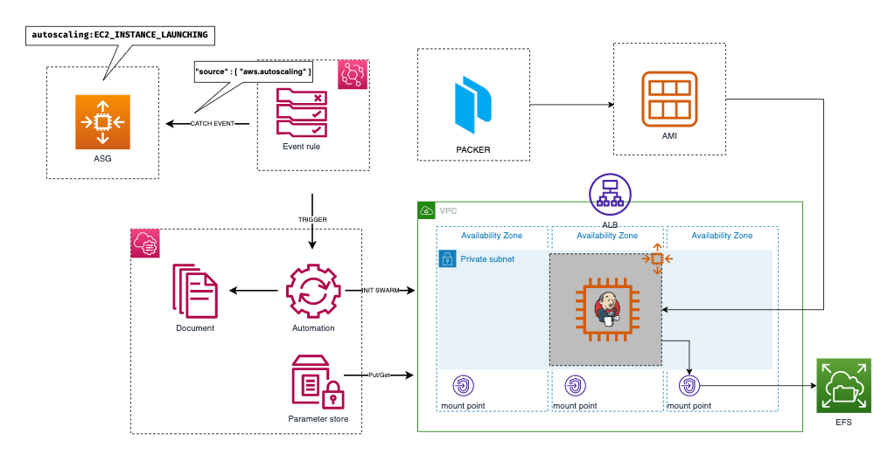

## Explore the possibilities of SSM
AWS Systems Manager is a collection of capabilities to help you manage your applications and infrastructure running in the AWS Cloud. Systems Manager simplifies application and resource management, shortens the time to detect and resolve operational problems, and helps you manage your AWS resources securely at scale.   

## Systems Manager capabilities
Systems Manager groups capabilities into the following categories. Choose the tabs under each category to learn more about each capability.
- Application management
- Change management
- Node management
- Operations management
- Quick Setup
- Shared resources

## What's SSM agent
AWS Systems Manager Agent (SSM Agent) is Amazon software that runs on Amazon Elastic Compute Cloud (Amazon EC2) instances, edge devices, and on-premises servers and virtual machines (VMs). SSM Agent makes it possible for Systems Manager to update, manage, and configure these resources. The agent processes requests from the Systems Manager service in the AWS Cloud, and then runs them as specified in the request. SSM Agent then sends status and execution information back to the Systems Manager service by using the Amazon Message Delivery Service (service prefix: ec2messages).

## Setup Jenkins HA with SSM (document, automation)
### **Build image**
```
cd AMI
	packer build jenkins.json
```
### **Architecture**


